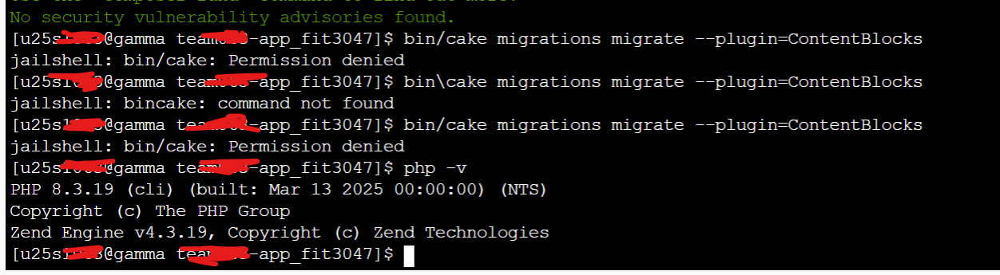

# Deployment Instructions

This document provides step-by-step instructions for deploying the application to a server, including environment configuration, database migrations, backup/restore, and scheduled maintenance tasks.

---

## Prerequisites

- Access to **Cpanel** (or equivalent hosting control panel)
- GitLab account with repository access
- Composer installed on the server
- PHP and required extensions installed
- MySQL/MariaDB database installed

see this for more details [Cakephp project prerequisite](https://book.cakephp.org/5/en/installation.html)

---

## Environments

- **Development**: Used for testing before production. Use a separate database and environment variables.
- **Production**: Live environment for end users. Ensure all credentials and configurations are production-ready.

---

## Deployment Process

### 1. Login to Cpanel

- Access your Cpanel account using your credentials.

### 2. Clone the Repository

- Open the **Terminal** in Cpanel.
- Navigate to the desired deployment directory:
  ```bash
  cd /your_directory_name
  ```
- Clone the repository:
  ```bash
  git clone https://git.infotech.monash.edu/UGIE/ugie-2025/team068/team068-app_fit3047.git your_directory_name
  ```
- Replace `your_directory_name` as needed.
- Authenticate with your GitLab credentials or personal access token ([GitLab Access Token Guide](https://docs.gitlab.com/user/profile/personal_access_tokens/)).

### 3. Install Dependencies

- Pull the latest changes:
  ```bash
  git pull origin main
  ```
- Install PHP dependencies:
  ```bash
  composer install
  ```

### 4. Configure Environment Variables

1. **Navigate to your config folder** from your project root:
    ```bash
    cd config
    ```

2. **Copy the example environment file:**
    ```bash
    cp .env.example .env
    ```

3. **Obtain required API keys (if not created yet):**
    - **Google reCAPTCHA:**
      If you do not have a reCAPTCHA key, follow the [Google reCAPTCHA instructions](https://cloud.google.com/recaptcha/docs/create-key-website#create-recaptcha-key-Admin%20console).
      After creating the key, add your domain at the [reCAPTCHA admin page](https://www.google.com/recaptcha/admin).
      
    - **Stripe:**
      If you do not have Stripe keys, follow the [Stripe documentation](https://docs.stripe.com/keys) to generate them.


4. **Add API keys to your `.env` file** (if not already present):
    ```env
    RECAPTCHA_SITE_KEY=your_recaptcha_site_key
    RECAPTCHA_SECRET_KEY=your_recaptcha_secret_key
    STRIPE_SECRET_KEY=your_stripe_secret_key
    STRIPE_PUBLISHABLE_KEY=your_stripe_publishable_key
    ```

> **Note:** Ensure all required environment variables are set before proceeding.


### 5. Database Configuration

1. **Create a new database and user** using phpMyAdmin in Cpanel (or your hosting control panel):
    - If you need to create a user, follow this guide: [Create a new user](https://docs.phpmyadmin.net/en/latest/privileges.html#creating-a-new-user) or watch this [video tutorial](https://www.youtube.com/watch?v=zS4g31spQ00).
    - If you need to create a database, follow this [Create new database tutorial](https://www.youtube.com/watch?v=H2VRiTvPv5k).
    - **Tip:** Use the naming convention `username_databasename` to associate the database with the user you just created.

2. **Update your database credentials** in `config/app_local.php`:
    ```php
    // ...existing code...
    'Datasources' => [
        'default' => [
            'host' => 'localhost',
            'username' => 'your_database_username',
            'password' => 'your_database_password',
            'database' => 'your_database_name',
            'url' => env('DATABASE_URL', null),
        ],
    ],
    // ...existing code...
    ```

> **Note:** Make sure the database user has the correct privileges for the new database.

### 6. Email Configuration

- In `config/app_local.php`, update the `EmailTransport` section:
  ```php
  // ...existing code...
  'EmailTransport' => [
      'default' => [
          'className' => SmtpTransport::class,
          'host' => 'localhost',
          'port' => 25,
          'username' => 'your_email',
          'password' => 'your_email_password',
          'tls' => true,
          'client' => null,
          'url' => env('EMAIL_TRANSPORT_DEFAULT_URL', null),
      ],
  ],
  // ...existing code...
  ```
- For testing, you can override all outgoing emails by adding this below `EmailTransport` section in `config/app_local.php`:
  ```php
  'Email' => [
      'override_enabled' => true,
      'override' => 'your_test_email',
  ],
  ```

### 7. Disable Warnings (Production Only)

- In `config/app_local.php`, set:
  ```php
  'debug' => filter_var(env('DEBUG', false), FILTER_VALIDATE_BOOLEAN),
  'Error' => [
      'useCakeErrorRenderer' => true,
      'errorLevel' => E_ALL & ~E_USER_DEPRECATED,
      'log' => true,
      'trace' => false,
  ],
  ```

### 8. Database Migration/Setup

Assuming you have already created the database and user in phpMyAdmin:

1. **Open phpMyAdmin** and select your project’s database.
2. Click on the **Import** tab.

#### Quick Setup
- Import the full schema in one step:
    - Select and import [`fit3047_iteration2_schema.sql`](../database/fit3047_iteration2_schema.sql).
    - 

#### Clean Setup (Recommended for Fresh Installs)
1. **Clear all tables:**
    - Import [`fit3047_clear_tables.sql`](../database/fit3047_clear_tables.sql).
    - 
2. **Define tables:**
    - Import [`fit3047_define_tables.sql`](../database/fit3047_define_tables.sql).
    - 
3. **Populate with dummy data:**
    - Import [`fit3047_populate_tables.sql`](../database/fit3047_populate_tables.sql).
    - 

> **Note:** Always disable foreign key checks before importing SQL files to avoid constraint errors.

### 9. Import/Restore Data (Optional)

#### Using the Terminal (MySQL CLI)
Assuming you have MySQL installed on your server. Replace `/path/to/backup.sql` with the actual path to your backup file.

- **Import backup data:**
    ```bash
    mysql -u your_database_username -p your_database_name < /path/to/backup.sql
    ```
- **Export a backup:**
    ```bash
    mysqldump -u your_database_username -p your_database_name > /path/to/backup.sql
    ```

#### Using phpMyAdmin

- Go to the **Import** tab in phpMyAdmin.
- Select your backup SQL file and click **Import**.
- Ensure you have disabled foreign key checks before importing.

> **Tip:** Disabling foreign key checks helps avoid constraint errors during import.

---
### 10. Content Management Migration

In the terminal, navigate to your project root folder and run the following commands in order:

```bash
# Install the content blocks plugin
composer require ugie-cake/cakephp-content-blocks

# Run plugin migrations
bin/cake migrations migrate --plugin=ContentBlocks

# Seed the content blocks data
bin/cake migrations seed --seed ContentBlocksSeed
```

If you encounter a permission issue during migration (see example below):


Run the following command in the terminal to fix permissions:

```bash
chmod +x bin/cake
```

Then, re-run the migration command.

---

## Post-Deployment Checklist

- [ ] Verify environment variables are correct in `config/.env` and `config/app_local.php`
- [ ] Confirm database connection and migrations
- [ ] Login to cpanel or test email environment with email you have set up earlier
- [ ] Test email sending (forgot password, checkout, etc.)
- [ ] Review application logs for errors

---

## Troubleshooting

- **Missing Extensions**: Check PHP extensions required by the application. You can run `composer install` command again in terminal in project root directory to make sure everything installed.
- **Logs**: Review `logs/` directory for error details.

---

For further assistance, refer to the [CakePHP Deployment Guide](https://book.cakephp.org/4/en/deployment.html) or contact the development team (UGIE team 068).
