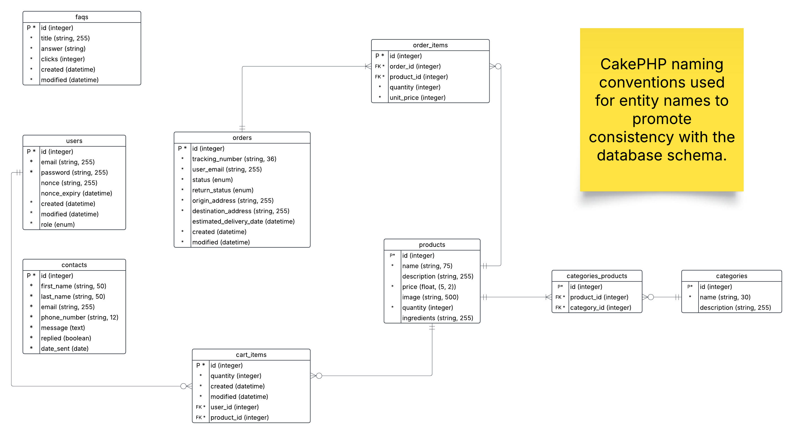

# High-level System Diagram
this document provides a high-level overview of the system architecture and design for the Crunchy Cravings e-commerce platform. It includes an ER diagram, a system architecture diagram, and a description of the how components interact with each other.

## ER Diagram

### Entities

- **users**: Represents users of the system, including customers and administrators.
    - `id`: Primary key, auto-increment. Uniquely identifies each user.
    - `email`: Unique email address for the user. Required for login and communication.
    - `password`: Hashed password for authentication.
    - `role`: ENUM ('admin', 'customer'). Defines user permissions.
    - `nonce`: Optional. Used for password reset; only set when needed.
    - `nonce_expiry`: Optional. Expiry for password reset nonce.
    - `created`: Timestamp for when the user was created.
    - `modified`: Timestamp for when the user was last modified.

- **products**: Represents items available for purchase.
    - `id`: Primary key, auto-increment.
    - `name`: Unique product name.
    - `description`: Optional. Details about the product.
    - `ingredients`: Optional. Lists product ingredients.
    - `price`: Product price. Required for transactions.
    - `image`: Optional. Path to product image.
    - `quantity`: Stock available. Default 0 if not set to prevent overselling.

- **categories**: Represents product categories.
    - `id`: Primary key, auto-increment.
    - `name`: Unique category name.
    - `description`: Optional. Details about the category.

- **orders**: Represents customer orders.
    - `id`: Primary key, auto-increment.
    - `tracking_number`: Unique tracking code for the order.
    - `user_email`: Email used at checkout. Not a foreign key to allow guest checkout.
    - `status`: ENUM ('pending', 'shipped', 'completed', 'cancelled'). Tracks order progress.
    - `return_status`: ENUM ('not_returned', 'returned'). Tracks returns.
    - `origin_address`: Where the order is shipped from.
    - `destination_address`: Shipping address.
    - `estimated_delivery_date`: Optional. For delivery tracking. Could be left unset when shipping route not finalised.
    - `created`: Timestamp for order creation.
    - `modified`: Timestamp for last update.

- **contacts**: Customer inquiries and messages.
    - `id`: Primary key, auto-increment.
    - `first_name`: Customer's first name.
    - `last_name`: Customer's last name.
    - `email`: Customer's email.
    - `phone_number`: Customer's phone number.
    - `message`: Inquiry content.
    - `replied`: Boolean. Indicates if the inquiry has been addressed.
    - `date_sent`: Date the inquiry was sent.

- **faqs**: Frequently asked questions.
    - `id`: Primary key, auto-increment.
    - `title`: Question title.
    - `answer`: Optional. Answer to the question.
    - `clicks`: Number of times the FAQ was viewed. Useful for analytics.
    - `created`: Timestamp for creation.
    - `modified`: Timestamp for last update.

### Relationships
- **users** to **products**: Many-to-Many (A user can have zero or more items in their cart, and a product can be in the cart of zero or more users), represented by bridging table `cart_items`.
- **cart_items**: Represents items in a user's cart.
    - `id`: Primary key, auto-increment.
    - `user_id`: Foreign key to `users`.
    - `product_id`: Foreign key to `products`.
    - `quantity`: Number of this product in the cart. Default 1.
    - `created`: Timestamp for when the item was added.
    - `modified`: Timestamp for last update.

- **products** to **categories**: Many-to-Many (A product must belong to at least one category, and a category can have zero or more products), represented by bridging table `categories_products`.
- **categories_products**:
    - `id`: Primary key, auto-increment.
    - `category_id`: Foreign key to `categories`.
    - `product_id`: Foreign key to `products`.

- **orders** to **products**: Many-to-Many (An order can must have at least an item of a product, and a product can be in multiple orders), represented by bridging table `order_items`.
- **order_items**: Represents products in an order.
    - `id`: Primary key, auto-increment.
    - `order_id`: Foreign key to `orders`.
    - `product_id`: Foreign key to `products`.
    - `quantity`: Number of this product in the order.
    - `unit_price`: Price per unit at time of order (for historical accuracy).

- **faqs** Have no direct relationship. FAQs can be used to address common inquiries, but they are separate entities.
- **contacts** Have no direct relationship. Contacts are used for customer inquiries and are not directly linked to other entities.

## System Architecture Diagram
